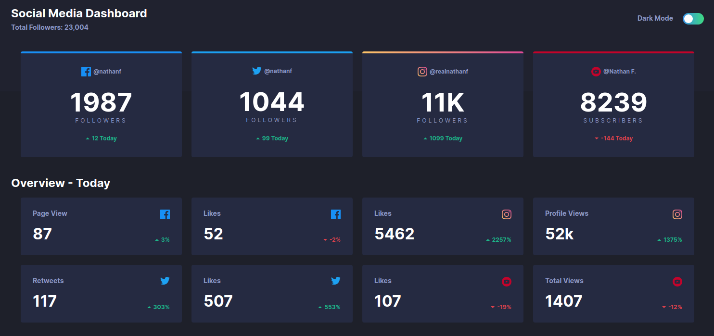

# Frontend Mentor - Social media dashboard with theme switcher solution

This is a solution to the [Social media dashboard with theme switcher challenge on Frontend Mentor](https://www.frontendmentor.io/challenges/social-media-dashboard-with-theme-switcher-6oY8ozp_H).

## Table of contents

- [Frontend Mentor - Social media dashboard with theme switcher solution](#frontend-mentor---social-media-dashboard-with-theme-switcher-solution)
  - [Table of contents](#table-of-contents)
  - [Overview](#overview)
    - [The challenge](#the-challenge)
    - [Screenshot](#screenshot)
    - [Links](#links)
  - [My process](#my-process)
    - [Built with](#built-with)
  - [Author](#author)

## Overview

### The challenge

Users should be able to:

- View the optimal layout for the site depending on their device's screen size
- See hover states for all interactive elements on the page
- Toggle color theme to their preference

### Screenshot

### Links

- Solution URL: [https://www.frontendmentor.io/solutions/responsive-social-media-dashboard-using-vite-vue-and-mobile-first-E17gUuBwB](https://www.frontendmentor.io/solutions/responsive-social-media-dashboard-using-vite-vue-and-mobile-first-E17gUuBwB)
- Live Site URL: [https://vite-media-dashboard.vercel.app/](https://vite-media-dashboard.vercel.app/)

## My process

### Built with

- Mobile First
- Semantic HTML5 markup
- CSS custom properties
- Flexbox
- CSS Grid

## Author

- Github - [leonardoaugustodev](https://github.com/leonardoaugustodev)
- Frontend Mentor - [@leonardoaugustodev](https://www.frontendmentor.io/profile/leonardoaugustodev)